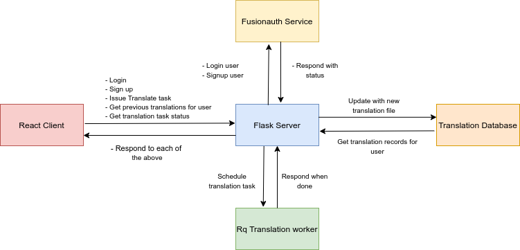

# Translation service Demo 

An implementation of a self-hosted translation service powered by neural networks via the [HuggingFace Transformers library](https://github.com/huggingface/transformers).


# Requirements
- Ubuntu OS (tested on Ubuntu 20)
- Nvidia GPU recommended, although not strictly necessary, with installed [CUDA](https://developer.nvidia.com/cuda-toolkit-archive)

# App installation
- Git clone this repo, then follow the specific instructions for each part of the application
## Frontend
- Install [NodeJs+NPM](https://www.npmjs.com/get-npm) (for frontend setup)
- For actually setting up the frontend part of the application
    ```
    cd translator_codebase/frontend/ && npm install
    ```
## Backend
- Install [Anaconda](https://www.anaconda.com/products/individual#Downloads)
- Install the latest [Pytorch](https://pytorch.org/) supported by your system.
- For setting up the translation engine, in the root of the codebase do (ie. translator_codebase):
    ```
    pip install -r requirements.txt
    ```
## Translation engine
- The translation service itself uses the [huggingface transformers library](https://github.com/huggingface/transformers), and was initially developed as a self-sufficient cli-app - in this sense I just included the translation engine as a git submodule to this project.
- In order to setup the requirements for the engine, just do:
    ```
    pip install -r model/requirements.txt
    ```

## Fusionauth setup
- Follow the steps from FusionAuth's website to [setup](https://fusionauth.io/docs/v1/tech/5-minute-setup-guide/) their server on your machine. You should only follow through the steps up to 7 included to have all the functionality necessary for the translation server enabled.
- Make sure you correctly setup the variables in the `translation_codebase/server_configs/fusion_auth_vars.py` according to the ones specific to your fusionauth deployment.

## Mongodb setup
- Follow the official instructions to install [mongodb](https://docs.mongodb.com/manual/tutorial/install-mongodb-on-ubuntu/) on your machine.

## Functionality of the application

### High level overview
- This is a client-server application that allows translation of text in various formats, from English to a target language, entirely on your premises. 

### Why is this useful?
- By means of a very powerful, open-source Transformer-based neural architecture for translation, you are able to translate `unlimited amounts of text`, as opposed to using a subscription based translation service such as Google Translate, which you have to pay for higher translation loads.
- The app currently also allows very easy translation of SubRip subtitles (`.srt`) from one language to the other, or translating
large plain text files - the service could be extended to translate specific formatted documents as well in the future!


### Securing access and adding users
- To secure access to your translation server, I also added user authentification via [FusionAuth](https://fusionauth.io/), which is free to use on your premises.
- This also allows persistent results for translation tasks, so that your users will be able to fetch translation results for files later from the server.

## Application Structure and how to run

### Frontend
- Constructed in javascript and uses ReactJs + Redux. This provides a web-browser based interface for making requests to the translation server. To start the frontend client, do:
    ```
    cd translator_codebase/frontend && npm start
    ```
### Backend
- Constructed in python with Flask. I used python and flask for this in order to easily interface with the translation service which is tied to the PyTorch translation model. For storing user information and translation task results I used MongoDB. To start the server, do
    ```
    cd translator_codebase && source fix_pythonpath.sh && python server.py
    ```

### Translation service
- Built in python, using Pytorch and the [HuggingFace Transformers](https://github.com/huggingface/transformers) library. Currently the Translation model employed is [MarianMT](https://huggingface.co/transformers/model_doc/marian.html). 
- I designed the service with the idea of decoupling the request/response handling between the client and server from the actual translation task, which can take a long time for big inputs of text.
- With the above in mind, I used [python-rq](https://python-rq.org/), a multiprocess task-queue framework that allows you to schedule and run long running tasks on different processes from your main one (ie. the flask server process)
- To allow the processing of translations tasks, ensure that at least one rq worker is running on your system:
    ```
    cd translator_codebase/ && source fix_pythonpath.sh && rq worker high default low
    ```